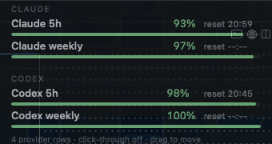
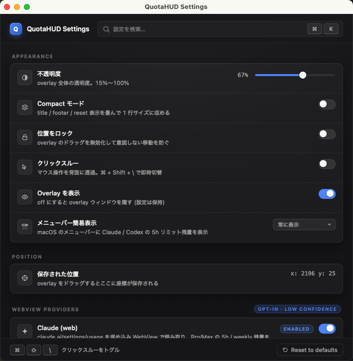

# QuotaHUD

A small cross-platform desktop overlay that surfaces remaining AI subscription-usage headroom for **Claude (Pro/Max)** on `claude.ai` and **ChatGPT (Plus/Pro/Codex agent)** on `chatgpt.com`. Built with **Tauri 2 + Rust** and **React + TypeScript + Vite**.

🇯🇵 日本語版: [README.ja.md](./README.ja.md)

## Product showcase

| Overlay HUD                                                                                                       | Settings                                                                                                            |
| ----------------------------------------------------------------------------------------------------------------- | ------------------------------------------------------------------------------------------------------------------- |
|  |  |

QuotaHUD parks a transparent, always-on-top HUD in the corner of your screen. Each opted-in provider becomes a single row with a horizontal remaining-usage gauge and a `reset at …` timestamp, so you can glance at it during a long coding session without context-switching to the vendor's web UI. The Settings window — a regular focusable window — hosts overlay tuning (opacity, click-through, lock, position) and the WebView provider login flow.

## Heads up: every value is an estimate

All shipped providers read the figure straight off the vendor's own web UI, so every number is an **estimate** (`source=webview-scrape`, `confidence=low`) that can break when the vendor changes their page layout. When extraction fails QuotaHUD shows a `no-data` / `error` status on the row instead of guessing — it never presents a stale or invented number as fact.

## Installation

> macOS builds are **ad-hoc signed** (no Apple Developer ID / notarization yet); Windows builds are **unsigned**. The release workflow does not use any Apple or Windows code-signing certificate.

1. Grab the latest build for your OS from the [GitHub Releases page](https://github.com/butaosuinu/ai-limit-quota-hud/releases).
2. Install or extract:
   - **macOS** (`.dmg` / `.app.tar.gz`): ad-hoc signed but not notarized, so Gatekeeper still asks for confirmation on first launch — you should no longer see the "is damaged … move it to the Trash" error. Right-click the `.app` and choose **Open** (on macOS 15 Sequoia, try to open it once, then allow it under **System Settings → Privacy & Security → Open Anyway**), or run `xattr -dr com.apple.quarantine /Applications/QuotaHUD.app` after copying it across.
   - **Windows** (`.msi` / `.exe`): SmartScreen will show "Windows protected your PC". Click **More info** → **Run anyway** if you trust the build.
   - **Linux** (`.AppImage` / `.deb`): for the AppImage run `chmod +x QuotaHUD-*.AppImage` once, then launch it. The `.deb` installs into the system package manager.
3. The first launch shows the overlay window. Use the tray menu or the Settings window to configure providers.

If you would rather build from source, see [Development](docs/DEVELOPMENT.md).

## Updates

QuotaHUD has built-in auto-updates via the Tauri updater plugin. Once the app is launched, it checks GitHub Releases for a newer version and offers to download and restart.

- Default-on: a startup check runs every launch.
- Opt out: Settings → Updates → toggle off "Check on startup".

### Migration from pre-updater builds

Users who installed any build before this release (`v0.0.0` and earlier) must download the first updater-enabled release manually — the older binaries do not have the updater plugin embedded.

## Using the overlay

QuotaHUD shows two windows:

- **Overlay** — the transparent always-on-top HUD. Drag-to-move when unlocked, click-through when enabled.
- **Settings** — a regular window with the opacity slider, compact / lock / click-through / visibility toggles, the persisted position, and a "reset to defaults" button. Hidden at startup; opened from the tray.

### Tray menu

QuotaHUD installs a system-tray icon (left-click opens the menu on every supported OS):

- **Show/Hide overlay** — toggles visibility without quitting.
- **Click-through** — when on, mouse events pass through the overlay.
- **Lock position** — when off, the overlay becomes draggable.
- **Settings…** — opens the Settings window.
- **Quit QuotaHUD** — exits the app.

### Global shortcut

`Cmd/Ctrl + Shift + \` toggles click-through. Registration is best-effort — if another app already owns the chord, QuotaHUD logs a warning and continues without it.

Overlay state (opacity, position, toggles) is persisted as JSON under the platform-standard app config directory. No secrets are stored there.

## WebView providers (opt-in)

QuotaHUD reads each vendor's own usage page directly in an embedded WebView. These providers are **disabled by default** — nothing navigates out to the network until you toggle them on in **Settings → WebView プロバイダ**.

- **Claude (web)** — reads `claude.ai/settings/usage` (Pro / Max plans). Implemented in this build.
- **ChatGPT Codex (web)** — reads `chatgpt.com` Codex analytics. The UI toggle is present, but the backend lands separately ([issue #31](https://github.com/butaosuinu/ai-limit-quota-hud/issues/31)) and the command returns an error today.

Enabling a provider opens the vendor's own login window on first use (QuotaHUD never renders its own login form), then refreshes via a hidden WebView. Session cookies stay in the OS-native WebView cookie store; a **Delete provider data** button forces re-login. QuotaHUD never reads keystrokes, passwords, or individual cookie values. For the refresh-interval and isolation rules see [`docs/PROJECT_SPEC.md` §8](docs/PROJECT_SPEC.md#8-provider-architecture--opt-in-webview-providers).

**Known limitations:**

- **Cloudflare challenges interrupt refresh.** When claude.ai serves a "Verify you are human" interstitial we surface an error rather than trying to bypass it. Open claude.ai in a normal browser to clear the challenge, then trigger a refresh.
- **Login session expiry.** If the cookie store has aged out, the next refresh shows "session expired". Use **Settings → WebView プロバイダ → ログイン** to re-authenticate.

## OS-specific overlay limitations

- **macOS**: the transparent overlay relies on a Tauri private API — fine for direct binary distribution, but not Mac App Store-friendly.
- **Windows**: persistent visibility across every virtual desktop is **not guaranteed** — depending on the OS build the overlay may stay on the desktop it was last shown on. Re-show it via the tray icon.
- **Linux**: X11 is the primary target. **Wayland is best-effort only** — most compositors refuse always-on-top / sticky hints, so the overlay may not float above every surface. The app degrades safely instead of crashing.

Details and the platform-specific implementation notes live in [`docs/PROJECT_SPEC.md` §9](docs/PROJECT_SPEC.md#9-overlayplatform-implementation).

## Privacy and security

- No telemetry. No automatic upload of usage data.
- No network call on startup unless the user has opted into a WebView provider.
- QuotaHUD does not handle API keys, OAuth tokens, or proxy credentials. The only persisted authentication material is the OS-native WebView cookie store for opt-in WebView providers — QuotaHUD code never reads individual cookie values, and "Delete provider data" wipes the per-provider session.
- During the vendor login flow, redirects to well-known identity providers (Google, Apple, Microsoft, Okta, Cloudflare Access, GitHub, …) are allowed because the vendor's own auth requires them. Outside the login redirect chain, the WebView is restricted to the configured target origin.

## Reporting an extractor issue

Open an issue with **sanitized** DOM excerpts (strip identifiers, conversation content, anything that would reveal account-specific data). Do not paste raw page dumps.

## Development

Build commands, requirements, CI structure, and the roadmap live in [`docs/DEVELOPMENT.md`](docs/DEVELOPMENT.md).

## License

[MIT License](./LICENSE) © 2026 ぶた桔梗
